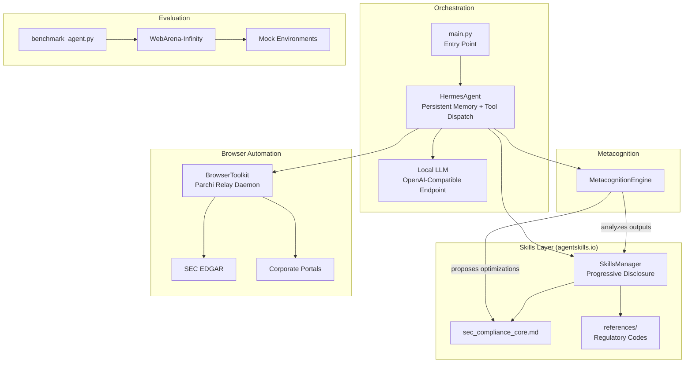

# Dark Factory v2

**Automated Financial Compliance & SEC Filing Synthesis**

A multi-agent system that autonomously navigates financial portals, extracts regulatory data from SEC filings, and synthesizes structured compliance reports. Built on the Hermes Agent orchestration framework with Parchi browser automation.

## Architecture



## Quickstart

```bash
# 1. Clone and enter the project
git clone https://github.com/your-org/dark-factory-v2.git
cd dark-factory-v2

# 2. Create virtual environment
python3.11 -m venv venv
source venv/bin/activate

# 3. Install dependencies
pip install -r requirements.txt

# 4. Configure environment
cp .env.example .env
# Edit .env with your local LLM endpoint and Parchi relay URL

# 5. Start your local LLM server (e.g., vLLM with Qwen)
# vllm serve Qwen/Qwen2.5-72B-Instruct --port 8000

# 6. Run the agent
python -m src.main --task "Analyze the latest 10-K filing for ACME Corp"

# Or run in interactive mode
python -m src.main --interactive
```

## Project Structure

```
dark-factory-v2/
├── requirements.txt          # Python dependencies
├── .env.example              # Environment variable template
├── .gitignore
├── README.md
├── src/
│   ├── __init__.py
│   ├── config.py             # Centralized settings (pydantic-settings)
│   ├── main.py               # Entry point & CLI
│   ├── hermes_agent.py       # Core agent: memory, tools, LLM loop
│   ├── skills_manager.py     # agentskills.io loader & progressive disclosure
│   ├── browser_tools.py      # Parchi Relay Daemon integration
│   └── metacognition.py      # Self-authoring feedback loop
├── skills/
│   ├── sec_compliance_core.md  # Primary compliance instruction set
│   └── references/
│       ├── regulation_s_k.md   # Regulation S-K reference
│       └── form_types.md       # SEC form taxonomy
├── tests/
│   ├── conftest.py             # Shared fixtures
│   ├── mock_environments.py    # Synthetic EDGAR & intranet servers
│   └── benchmark_agent.py      # Performance benchmarking
└── data/
    ├── mock_10k_acme_corp.json       # Synthetic 10-K filing
    └── mock_compliance_report.json   # Sample output format
```

## Modules

| Module | Purpose |
|---|---|
| `src/config.py` | Loads `.env`, validates settings via Pydantic, exports singleton config |
| `src/hermes_agent.py` | Persistent-memory agent with function-calling tool dispatch |
| `src/skills_manager.py` | Parses agentskills.io Markdown, progressive context disclosure |
| `src/browser_tools.py` | Parchi HTTP bridge: navigation, extraction, form interaction |
| `src/metacognition.py` | Post-task output analysis, autonomous skill refinement proposals |

## Evaluation

```bash
# Run benchmarks against mock environments
python -m tests.benchmark_agent

# Run unit tests
python -m pytest tests/ -v
```

## License

MIT
